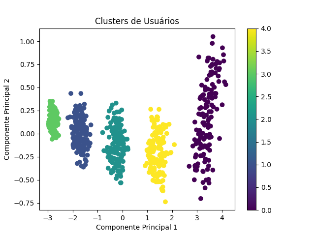

# 📱 Mobile User Behavior Analysis

This project analyzes mobile device usage patterns to classify user behavior into five distinct categories. The analysis explores how users interact with their devices, focusing on app usage, screen time, battery consumption, and demographic information. Clustering techniques were applied to validate predefined user behavior classes and discover meaningful patterns.

## 🔋 Key Features
- **Daily Usage Patterns**: App usage time, screen-on time, and battery consumption.
- **Demographic Data**: Age, gender, device model, and operating system.
- **Clustering Analysis**: Segments users into behavioral categories based on device usage.

## 🗂️ Applications
- Predicting mobile user behavior.
- Identifying trends in battery and data consumption.
- Supporting app development and optimization strategies.

## 📂 Dataset
The dataset used in this project is publicly available on Kaggle:  
[Mobile Device Usage and User Behavior Dataset](https://www.kaggle.com/datasets/valakhorasani/mobile-device-usage-and-user-behavior-dataset)

### How to Use the Dataset
1. Visit the [dataset page on Kaggle](https://www.kaggle.com/datasets/valakhorasani/mobile-device-usage-and-user-behavior-dataset).
2. Download the dataset file (`user_behavior_dataset.csv`).
3. Place the file in the `data/` folder of this repository.

## 🛠️ Methodology
1. **Data Preprocessing**:
   - Removed irrelevant columns (e.g., `User ID`).
   - Normalized numerical features using `StandardScaler`.
   - Encoded categorical features using `LabelEncoder`.

2. **Clustering Analysis**:
   - Applied K-Means clustering to segment users into 5 clusters.
   - Visualized clusters using PCA (Principal Component Analysis).
   - Evaluated clustering performance using:
     - Silhouette Score: `0.60` (moderate quality).
     - Adjusted Rand Index (ARI): `1.00` (perfect alignment with predefined classes).

3. **Visualization**:
   - Plotted clusters in 2D for easier interpretation of user behavior patterns.

## 🎯 Results
### Cluster Descriptions
| Cluster | Behavior Type                            |
|---------|------------------------------------------|
| 0       | High app usage and battery consumption.  |
| 1       | Moderate usage with balanced screen time.|
| 2       | Neutral behavior with average data usage.|
| 3       | Minimal app usage and low battery usage. |
| 4       | High data usage with efficient battery use.|

### Evaluation Metrics
- **Silhouette Score**: Indicates moderate clustering quality.
- **Adjusted Rand Index**: Confirms perfect alignment between clusters and predefined behavior classes.

## 🧮 Key Statistics
- **Average App Usage**: 271 minutes/day (~4.5 hours).
- **Screen On Time**: 5.27 hours/day.
- **Battery Drain**: 1525 mAh/day.
- **Data Usage**: 929 MB/day.

## 📈 Visualization
  
*Clusters visualized using PCA (2D projection).*

## 🧑‍💻 Requirements
Install the required Python libraries:
```bash
pip install -r requirements.txt
